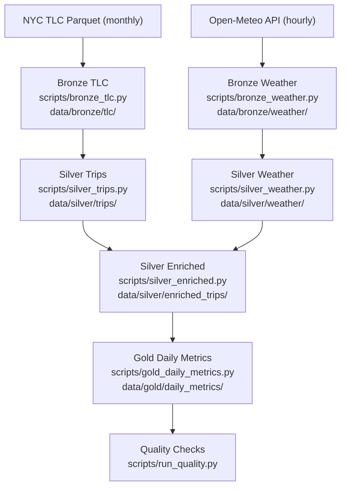

# NYC Taxi + Weather Lakehouse (Local-First Data Engineering Project)

## What this project is
I built this repo as an interview-ready data engineering project that runs fully on a laptop.
It covers the full path from raw data to analytics outputs:
- Batch ingestion of NYC TLC trip parquet files
- Incremental API ingestion from Open-Meteo
- Spark transformations across Bronze/Silver/Gold layers
- Data quality checks and tests
- Reproducible run evidence in docs

The implementation is local-first (filesystem + local Spark), but the layer design is the same pattern used in cloud data stacks.

## Business question
How do daily NYC taxi demand and pricing metrics change with weather conditions?

## Data sources
- NYC TLC trip records: [NYC TLC](https://www.nyc.gov/site/tlc/about/tlc-trip-record-data.page)
- Open-Meteo archive API: [Open-Meteo Docs](https://open-meteo.com/en/docs)

## Pipeline architecture


## What each layer contains
- Bronze:
  - Raw monthly TLC parquet files
  - Raw daily weather JSON + ingestion state file (`_state.json`)
- Silver:
  - `trips`: cleaned and standardized trip rows
  - `weather`: typed hourly weather rows
  - `enriched_trips`: trips joined to weather on pickup date/hour
- Gold:
  - `daily_metrics`: business-facing daily aggregates

## Quick start
Run from `/Users/mhydarali/Documents/McGill/McGill_MMA/personal_project_2`.

1. Install dependencies:
```bash
make sync
```
2. Run tests:
```bash
make test
```
3. Run lint:
```bash
make lint
```
4. Run the full pipeline:
```bash
make run
```
5. Inspect outputs:
```bash
.venv/bin/python scripts/inspect_outputs.py --sample-size 3
```

## Custom run (small window)
```bash
.venv/bin/python scripts/run_all.py \
  --mode local \
  --taxi-type yellow \
  --start-month 2024-01 \
  --end-month 2024-01 \
  --weather-start-date 2024-01-01 \
  --weather-end-date 2024-01-02
```

## Latest run snapshot
From a local run inspected on February 22, 2026:
- `silver.trips`: 2,927,120 rows
- `silver.weather`: 72 rows (3 weather days x 24 hours)
- `silver.enriched_trips`: 2,927,120 rows
- `gold.daily_metrics`: 35 rows

Note: if you rerun without clearing data folders, older partitions may remain from previous runs.

## Data quality and testing
- Quality checks include non-empty outputs, null-rate checks, range checks, and dedup/uniqueness rules.
- Unit tests cover ingestion helpers, weather state handling, and Spark transforms.

## Design choices and tradeoffs
- Kept dependencies lightweight for easy local setup.
- Used partitioned parquet instead of a warehouse table format to keep the project simple and portable.
- Used deterministic join keys (`pickup_date`, `pickup_hour`) and aligned both sources to `America/New_York`.

## Repository layout
```text
src/mobility_lakehouse/
  config.py
  pipelines/
  quality/
  utils/
scripts/
docs/
notebooks/
tests/
```

## Supporting docs
- Architecture details: `docs/architecture.md`
- Data source notes: `docs/data_sources.md`
- Reproducible run evidence: `docs/run_evidence.md`
- Interview prep notes: `docs/interview_talking_points.md`
- One-page command sheet: `docs/one_page_cheatsheet.md`
