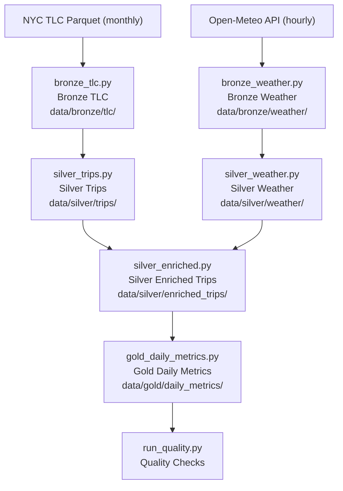

# City Mobility Lakehouse (Local-First Portfolio Project)

## Executive Summary (Non-Technical)
This project automates how a transportation team would turn raw taxi and weather data into daily business metrics. Instead of manual spreadsheet work, the pipeline runs end-to-end and produces a clean daily table that can support operational planning, demand analysis, and pricing discussions.

## Problem Statement
Urban mobility teams need a reliable way to understand daily taxi demand and pricing behavior under changing weather conditions. Raw trip files and weather API payloads are messy, live in different formats, and are not analytics-ready.

## Goal
Build a complete end-to-end data pipeline that ingests a large public dataset (NYC TLC trips) and a public API (Open-Meteo weather), processes them through Bronze/Silver/Gold layers with Spark, and produces an analytics-ready daily metrics table.

## Sector / Use Case
Transportation analytics, city operations, and mobility demand planning.

## Why This Matters
Without a structured pipeline, analysts spend time manually downloading files, cleaning schema mismatches, and joining hourly weather to trip timestamps. This project automates that workflow so teams can focus on decisions, not data wrangling.

## Local-First, Cloud-Transferable
This repository is intentionally designed to run locally (Python + Spark + local filesystem) while using engineering patterns directly transferable to cloud data platforms:
- Medallion architecture (Bronze/Silver/Gold)
- Partitioned Parquet outputs
- Incremental ingestion state tracking
- Data quality checks
- Orchestration-ready stage entrypoints

## Architecture Overview



## Visuals
- Architecture diagram: Mermaid flow in this README.
- Detailed architecture reference: `docs/architecture.md`
- Reproducible run outputs and partition evidence: `docs/run_evidence.md`
- Interview walkthrough assets: `docs/interview_talking_points.md`

## Data Source, Transformation & Output
### Data Sources
- NYC TLC Trip Records: [NYC TLC](https://www.nyc.gov/site/tlc/about/tlc-trip-record-data.page)
- Open-Meteo Archive API: [Open-Meteo Docs](https://open-meteo.com/en/docs)

### Transformation
- Bronze:
  - Raw TLC parquet downloaded by month.
  - Raw weather JSON ingested by day with incremental state file.
- Silver:
  - Trips standardized and cleaned (timestamps, ranges, dedupe).
  - Weather normalized into typed hourly parquet.
  - Trips enriched with weather using pickup date + pickup hour.
- Gold:
  - Daily metrics mart with trip volume, fare averages, distance averages, surge proxy, payment mix, and weather impact fields.

### Final Output Location
- `data/gold/daily_metrics/date=YYYY-MM-DD/`

## Pipeline Execution (Step-by-Step)
1. Sync dependencies:
```bash
make sync
```
2. Run tests:
```bash
make test
```
3. Run lint:
```bash
make lint
```
4. Run full pipeline locally:
```bash
make run
```
5. Inspect outputs (schema, row counts, sample rows):
```bash
.venv/bin/python scripts/inspect_outputs.py --sample-size 3
```

### Optional: Custom Small Run
```bash
.venv/bin/python scripts/run_all.py \
  --mode local \
  --taxi-type yellow \
  --start-month 2024-01 \
  --end-month 2024-01 \
  --weather-start-date 2024-01-01 \
  --weather-end-date 2024-01-02
```

## Results
From a sample run (January 2024 yellow taxi + two weather days ingested):
- `silver.trips`: 2,927,120 rows
- `silver.weather`: 48 rows
- `silver.enriched_trips`: 2,927,120 rows
- `gold.daily_metrics`: 35 daily records
- Quality checks: Passed in pipeline run (`run_all.py` completed successfully)

See full reproducible evidence in `docs/run_evidence.md`.

## Skills Demonstrated
- Batch ingestion of large parquet datasets (TLC monthly files)
- Incremental API ingestion with checkpoint state (`_state.json`)
- Spark-based cleaning, schema standardization, deduplication, joins, and aggregations
- Bronze/Silver/Gold data modeling with partitioned parquet outputs
- Lightweight data quality validation (row count, null thresholds, ranges, uniqueness)
- Orchestration-ready CLI entrypoints and end-to-end runner
- Automated testing (including mocked API behavior)

## Learnings
- Real-world datasets require flexible schema harmonization (column name drift, type casting).
- Time alignment (timezone + hourly join keys) is critical for correct enrichment.
- Incremental ingestion state prevents unnecessary API calls and supports safe reruns.
- Spark warnings under memory pressure can be non-fatal when writes are still successful.

## Repository Structure
```text
src/mobility_lakehouse/
  config.py
  pipelines/
  quality/
  utils/
scripts/
notebooks/
docs/
tests/
requirements.txt
data/{bronze,silver,gold}
logs/
```

## Interview Prep Assets
- Architecture details: `docs/architecture.md`
- Run evidence/proof pack: `docs/run_evidence.md`
- Talking points and Q&A: `docs/interview_talking_points.md`
