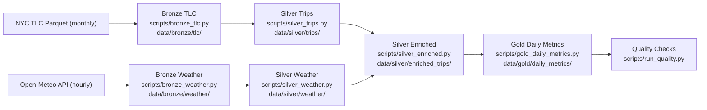

# Architecture

This project implements a local-first medallion pipeline that mirrors common production data platform patterns.

## Canonical Flow

## Layers

### Bronze
- `data/bronze/tlc/taxi_type=<yellow|green>/year=YYYY/month=MM/*.parquet`
  - Raw monthly TLC parquet downloads.
  - Resumable logic: skip existing non-empty files.
- `data/bronze/weather/date=YYYY-MM-DD/weather.json`
  - Raw daily weather JSON.
  - Incremental state file: `data/bronze/weather/_state.json`.

### Silver
- `data/silver/trips/` (partitioned by `pickup_date`, `taxi_type`)
  - Standardized trip schema with typed/cast columns.
  - Adds `pickup_date` and `pickup_hour` for enrichment.
- `data/silver/weather/` (partitioned by `date`)
  - Typed hourly weather table (`timestamp`, `temperature_2m`, `precipitation`, `windspeed_10m`, `date`, `hour`).
- `data/silver/enriched_trips/` (partitioned by `pickup_date`)
  - Left join of trips to weather on `pickup_date == date` and `pickup_hour == hour`.

### Gold
- `data/gold/daily_metrics/date=YYYY-MM-DD/`
  - Daily analytics-ready metrics:
    - `total_trips`
    - `avg_fare_amount`
    - `avg_total_amount`
    - `avg_trip_distance`
    - `surge_proxy`
    - `payment_type_counts`
    - `avg_temp`
    - `total_precip`

## Cleaning Rules (Silver Trips)
- Drop null pickup/dropoff timestamps.
- Keep rows where `dropoff_datetime >= pickup_datetime`.
- Enforce `trip_distance >= 0`.
- Enforce `fare_amount >= 0`.
- Deduplicate by business key:
  - `vendor_id`, `pickup_datetime`, `dropoff_datetime`, `pu_location_id`, `do_location_id`, `total_amount`.

## Join & Time Alignment
- Weather requests use `America/New_York`.
- Spark session uses `America/New_York`.
- Enrichment join key: `(pickup_date, pickup_hour)`.

## Execution Modes
- `local`: PySpark local execution.
- `docker`: Spark stages submitted to Docker Spark cluster (if available).
