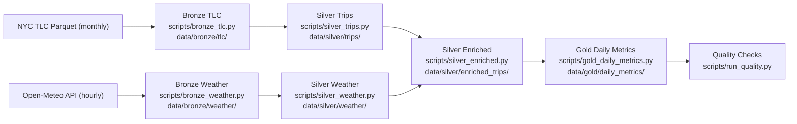

# Architecture

This project uses a local medallion pattern (`bronze -> silver -> gold`) with Spark for transformations.

## End-to-end flow

## Layer contracts

### Bronze (raw)
- TLC files: `data/bronze/tlc/taxi_type=<yellow|green>/year=YYYY/month=MM/*.parquet`
- Weather files: `data/bronze/weather/date=YYYY-MM-DD/weather.json`
- Incremental weather state: `data/bronze/weather/_state.json`

### Silver (cleaned)
- `data/silver/trips/`
  - Standardized trip schema
  - Adds `pickup_date` and `pickup_hour`
- `data/silver/weather/`
  - Typed hourly weather rows
- `data/silver/enriched_trips/`
  - Left join on `pickup_date == date` and `pickup_hour == hour`

### Gold (analytics)
- `data/gold/daily_metrics/date=YYYY-MM-DD/`
- Metrics include trip volume, fare/amount averages, distance average, payment mix, and weather aggregates.

## Cleaning rules in Silver trips
- Drop rows with null pickup/dropoff timestamps
- Keep rows where `dropoff_datetime >= pickup_datetime`
- Keep rows where `trip_distance >= 0`
- Keep rows where `fare_amount >= 0`
- Deduplicate on:
  - `vendor_id`, `pickup_datetime`, `dropoff_datetime`, `pu_location_id`, `do_location_id`, `total_amount`

## Time alignment
- Weather API timezone: `America/New_York`
- Spark SQL session timezone: `America/New_York`
- Join keys: `pickup_date`, `pickup_hour`

## Run modes
- `local`: all Spark work runs locally
- `docker`: submits Spark stages to Docker Spark services when available
